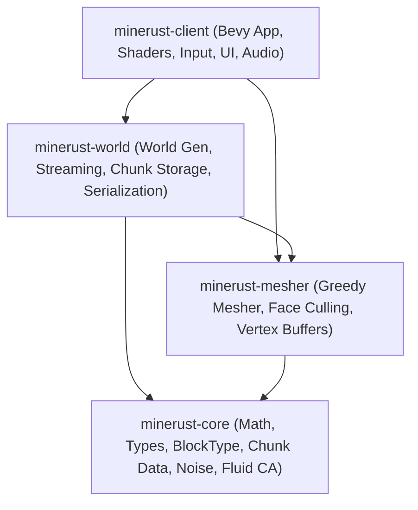
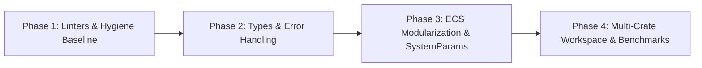

# MineRust: Production-Grade Engineering Standards & Architecture Guidelines

This document establishes the binding architectural, quality, and engineering standards for the transition of **MineRust** from a prototype MVP into a **production-grade voxel game engine**.

All current and future code within the repository must strictly comply with these standards.

---

## Table of Contents
1. [Vision & Core Principles](#1-vision--core-principles)
2. [Software Architecture & Workspace Structure](#2-software-architecture--workspace-structure)
3. [Rust Coding Standards & Safety Policy](#3-rust-coding-standards--safety-policy)
4. [Bevy & ECS Architectural Guidelines](#4-bevy--ecs-architectural-guidelines)
5. [Performance Engineering & Memory Management](#5-performance-engineering--memory-management)
6. [Testing, Verification & Quality Assurance](#6-testing-verification--quality-assurance)
7. [Linters, Formatting & CI/CD Pipeline](#7-linters-formatting--cicd-pipeline)
8. [Git Workflow, Conventions & Documentation](#8-git-workflow-conventions--documentation)
9. [Incremental Migration Roadmap](#9-incremental-migration-roadmap)

---

## 1. Vision & Core Principles

A production-grade voxel system is not just a rendering demo: it is a **robust, deterministic, highly concurrent computational engine**.

The project is governed by five non-negotiable engineering pillars:

1. **Correctness & Type Safety**: Leverage Rust's type system to make invalid game states unrepresentable at compile time (*"Parse, don't validate"*).
2. **Zero-Panic Runtime**: Zero panics tolerated during active gameplay, terrain streaming, or simulation ticks. All failure modes must be explicitly represented via `Result` and strongly typed errors (`thiserror`).
3. **Cross-Platform Determinism**: For any given 64-bit Seed and coordinate, procedural generation, cellular automata fluid simulation, and meshing output must produce bit-for-bit identical results regardless of target architecture (x86_64, ARM64, WASM).
4. **Data-Oriented Design & Zero-Allocation Hot Paths**: Routines executed on frame updates (rendering loops, camera, input, physics, fluid steps) must never perform uncontrolled dynamic heap allocations.
5. **Separation of Domain & Presentation**: The core mathematical and voxel models (pure Rust, zero engine dependencies) must be cleanly decoupled from the presentation and engine layer (Bevy ECS, rendering, audio, UI).

---

## 2. Software Architecture & Workspace Structure

### 2.1 Cargo Multi-Crate Workspace Architecture
To ensure minimal compilation times, isolated unit testing, and elimination of circular dependencies, MineRust will transition from a single monolithic crate into a modular **Cargo Workspace**:



- **`minerust-core`** (Zero Bevy dependencies):
  - Pure mathematical voxel primitives and coordinate newtypes (`BlockPos`, `ChunkPos`, `LocalBlockPos`, `WorldPos`).
  - Block definition catalog (`BlockType`, opacity, solidity, physical attributes).
  - Compact `Chunk` representation (contiguous flat buffer, bitmasks).
  - Procedural noise functions (Perlin, FBM, Ridged multi-fractals).
  - Cellular automaton fluid simulation logic.
- **`minerust-mesher`**:
  - High-performance greedy meshing algorithms, interior face culling, ambient occlusion (AO) masks, and LOD compression.
  - Generates raw vertex/index data independent of any specific graphics backend.
- **`minerust-world`**:
  - Chunk storage grid, asynchronous streaming scheduler, disk caching, and binary serialization/deserialization.
- **`minerust-client`**:
  - Bevy ECS system orchestration, PBR materials, texture atlas management, FPS camera, HUD/UI, and player input binding.

### 2.2 Semantic Coordinate Newtypes
Using raw `IVec3`, `IVec2`, or tuples for distinct coordinate spaces is strictly prohibited. Semantic newtypes must be used across all APIs:

```rust
/// Absolute world-space integer block coordinate (e.g. x=34, y=64, z=-12).
#[derive(Copy, Clone, Debug, PartialEq, Eq, Hash)]
pub struct BlockPos(pub IVec3);

/// Chunk-space coordinate grid index (e.g. cx=2, cz=-1).
#[derive(Copy, Clone, Debug, PartialEq, Eq, Hash)]
pub struct ChunkPos(pub IVec2);

/// Chunk-local block coordinate (x: 0..16, y: 0..128, z: 0..16).
#[derive(Copy, Clone, Debug, PartialEq, Eq)]
pub struct LocalBlockPos {
    pub x: u8,
    pub y: u8,
    pub z: u8,
}

impl BlockPos {
    #[inline]
    pub fn to_chunk_and_local(self) -> (ChunkPos, LocalBlockPos) {
        let cx = self.0.x.div_euclid(16);
        let cz = self.0.z.div_euclid(16);
        let lx = self.0.x.rem_euclid(16) as u8;
        let ly = self.0.y.clamp(0, 127) as u8;
        let lz = self.0.z.rem_euclid(16) as u8;
        (ChunkPos(IVec2::new(cx, cz)), LocalBlockPos { x: lx, y: ly, z: lz })
    }
}
```

---

## 3. Rust Coding Standards & Safety Policy

### 3.1 Memory Safety Policy
- **`#![forbid(unsafe_code)]`**: The use of `unsafe` is strictly forbidden in all gameplay, physics, generation, and user-facing code.
- Any rare exception (e.g., hardware SIMD acceleration on raw vertex streams) must be strictly isolated into a low-level utility module, accompanied by comprehensive Miri tests, fuzzing harnesses, and formal documentation.

### 3.2 Error Handling & Resilience
1. **Ban on Runtime `unwrap()` and `expect()`**:
   - Calling `unwrap()` or `expect()` in Bevy systems, tick loops, chunk streaming, or disk I/O is completely forbidden.
   - `expect()` is only permitted during static engine startup initialization if failure prevents the program from starting entirely (e.g., missing critical embedded asset).
   - In internal algorithmic logic, use `debug_assert!` and `debug_assert_eq!` to document and enforce mathematical invariants with zero release overhead.
2. **Explicit Strongly-Typed Errors**:
   Every subsystem that can fail must expose concrete error enums using `thiserror`:
   ```rust
   #[derive(thiserror::Error, Debug)]
   pub enum ChunkStorageError {
       #[error("Chunk position {0:?} is out of valid bounds")]
       OutOfBounds(ChunkPos),
       #[error("Underlying I/O error occurred: {0}")]
       Io(#[from] std::io::Error),
       #[error("Corrupted chunk data: {0}")]
       DeserializationFailed(String),
   }
   ```

### 3.3 Ownership and Borrowing Hygiene
- Pass by reference (`&T`, `&mut T`) by default.
- Prevent unneeded cloning of heavy structures: `Chunk` data passed to background workers must use immutable smart pointers (`Arc<[BlockType; CHUNK_BLOCKS]>`) or Copy-on-Write (`Cow`).

### 3.4 Standard Industry Crates & Ecosystem Libraries
The project mandates standard, battle-tested Rust ecosystem crates across all modules:
- **`tracing`**: Mandatory for all telemetry, performance spans, and diagnostic logging (`tracing::info!`, `warn!`, `debug!`, `info_span!`). Raw `println!` is strictly prohibited in runtime systems.
- **`thiserror`**: Standard for strongly-typed, zero-overhead domain library errors with descriptive error messages.
- **`anyhow`**: Standard for top-level application bootstrapping, CLI argument parsing, and outer error propagation where context layering is required.
- **`serde` & `serde_json`**: Industry-standard data serialization format for world save files, player state, configuration files, and dev settings.
- **`smallvec` & `arrayvec`**: Small, stack-allocated, fixed-capacity vector alternatives to eliminate heap allocations in hot loops (neighbor lookups, face quad vertices, flood queues).
- **`criterion`** (dev): Benchmark framework for preventing performance regressions across commits.
- **`proptest`** (dev): Property-based testing framework for generative fuzzing of noise algorithms, coordinate transforms, and serialization integrity.

---

## 4. Bevy & ECS Architectural Guidelines

### 4.1 Modular Feature Plugins
Every gameplay or engine domain must be encapsulated within an autonomous Bevy `Plugin`:
- `WorldGenerationPlugin`
- `ChunkStreamingPlugin`
- `VoxelMeshingPlugin`
- `FluidSimulationPlugin`
- `VoxelInteractionPlugin`
- `PlayerPhysicsPlugin`
- `DevToolsUiPlugin`

### 4.2 System Design & Parameter Aggregation
- **Parameter Limit Rule**: Systems must not declare more than 6 direct arguments. When a system requires extensive resources and queries, bundle related access into custom `#[derive(SystemParam)]` structs:
  ```rust
  #[derive(SystemParam)]
  pub struct ChunkMeshPipeline<'w, 's> {
      pub commands: Commands<'w, 's>,
      pub meshes: ResMut<'w, Assets<Mesh>>,
      pub materials: ResMut<'w, Assets<StandardMaterial>>,
      pub mesher_pool: Res<'w, ChunkMesherPool>,
  }
  ```
- **Explicit SystemSets & Execution Ordering**:
  All systems must belong to named `SystemSet`s with explicit ordering dependencies (`before()`, `after()`, `run_if(in_state(...))`):
  ```rust
  #[derive(SystemSet, Debug, Clone, PartialEq, Eq, Hash)]
  pub enum VoxelStage {
      InputHandling,
      PlayerPhysics,
      FluidSimulation,
      WorldStreaming,
      MeshBuilding,
  }
  ```

---

## 5. Performance Engineering & Memory Management

### 5.1 Zero-Allocation Hot Paths
- Systems executed on the `Update` schedule must avoid allocating `Vec`, `HashMap`, or heap `String` instances on every frame.
- Utilize pre-allocated, reusable scratch buffers:
  - `buffer.clear()` retains previously allocated heap capacity (`capacity()`).
  - Use `ArrayVec` or `SmallVec` for fixed-capacity collections (e.g. 6 block neighbors, 4 vertex quads).

### 5.2 CPU Cache Locality & Data Layout
- Blocks within chunks must be laid out in memory according to cache traversal patterns:
  ```rust
  #[inline(always)]
  pub const fn block_index(lx: usize, ly: usize, lz: usize) -> usize {
      lx + lz * CHUNK_WIDTH + ly * (CHUNK_WIDTH * CHUNK_DEPTH)
  }
  ```
- Avoid fragmented object graphs; embrace flat arrays and contiguous memory blocks.

### 5.3 Diagnostic Profiling
- All heavy computational steps (world generation, greedy meshing, fluid processing batches) must be instrumented with tracing spans:
  ```rust
  let _span = info_span!("greedy_meshing", chunk = ?chunk_pos).entered();
  ```

---

## 6. Testing, Verification & Quality Assurance

The codebase enforces a rigorous **Testing Pyramid**:

```
           / \
          /   \     Integration Tests (End-to-end streaming, persistence)
         /-----\
        /       \    Property-Based Tests (proptest: noise determinism, math bounds)
       /---------\
      /           \  Unit Tests (Math, indexing, greedy mask merging, fluid rules)
```

1. **Unit Testing (Target: >85% coverage on Core and Mesher)**:
   - Every coordinate conversion, index mapping, and voxel meshing rule must have exhaustive unit tests.
2. **Property-Based Testing (`proptest`)**:
   - Random fuzzing of arbitrary `(i32, i32, i32)` coordinate inputs to prove the absence of arithmetic overflow, panic, or out-of-bounds access.
   - Assert invariant that meshing outputs always generate valid indices matching vertex counts.
3. **Performance Regression Testing (`criterion`)**:
   - Dedicated benchmark suite in `benches/`:
     - `bench_greedy_meshing`: Measures microsecond timings on dense chunks, flatlands, and cavernous geometry.
     - `bench_noise_generation`: Measures SIMD/FBM procedural terrain evaluation throughput.
     - `bench_fluid_propagation`: Benchmarks cellular automata batch processing speed.
4. **Automated Hardware Streaming Benchmarking (`src/benchmark.rs`)**:
   - Automated 5km trajectory flight tests at 50 m/s with seed `"BENCHMARK"`.
   - Continuous stress-testing and telemetry validation of multithreaded chunk streaming, LRU cache eviction, greedy quad merging, and 1% low frame pacing under heavy real-time procedural workloads.

---

## 7. Linters, Formatting & CI/CD Pipeline

### 7.1 Centralized Linter Configuration (`Cargo.toml`)
Strict workspace lint enforcement:

```toml
[lints.rust]
unsafe_code = "forbid"
missing_debug_implementations = "warn"
rust_2024_compatibility = "warn"

[lints.clippy]
all = { level = "deny", priority = -1 }
pedantic = { level = "warn", priority = -1 }
nursery = { level = "warn", priority = -1 }

# Explicit allowances justified by graphics / ECS conventions
too_many_arguments = "allow" # Managed progressively via SystemParam refactoring
module_name_repetitions = "allow"
cast_possible_truncation = "allow" # Voxel coordinates bounded by chunk dimensions
cast_precision_loss = "allow"
```

### 7.2 Formatting Enforcement (`rustfmt.toml`)
All source code must format cleanly with standard Rust formatting (`cargo fmt --check`).

---

## 8. Git Workflow, Conventions & Documentation

### 8.1 Conventional Commits
All commits must follow the conventional commits standard:
- `feat(scope)`: New user-facing feature or gameplay capability.
- `fix(scope)`: Bug fix or corrective measure.
- `refactor(scope)`: Structural code changes with no behavior alteration.
- `perf(scope)`: Performance optimization backed by benchmark metrics.
- `test(scope)`: Adding or refining test suites.
- `docs(scope)`: Documentation, rustdoc comments, or ADRs.
- `chore(scope)`: Build system, dependencies, or configuration changes.

### 8.2 Architecture Decision Records (ADR)
Every major technical decision (e.g. meshing strategy changes, storage formats, compute shader migrations) must be documented under `docs/adr/`:
- `YYYYMMDD-decision-title.md` (Context, Evaluated Options, Chosen Decision, Consequences).

---

## 9. Incremental Migration Roadmap

The transition from MVP to Production-Grade proceeds across four progressive phases, keeping the game runnable and fully functional at each milestone:



1. **Phase 1: Linters & Code Hygiene Baseline**:
   - Configure centralized `[lints]` in `Cargo.toml`.
   - Resolve all Clippy warnings and errors systematically.
   - Enforce uniform code formatting across all files.
2. **Phase 2: Type Safety & Robust Error Handling**:
   - Introduce `BlockPos`, `ChunkPos`, and `LocalBlockPos` newtypes.
   - Eliminate runtime `unwrap()` calls, replacing them with typed `Result` and `thiserror`.
3. **Phase 3: ECS Modularization & SystemParam Refactoring**:
   - Reorganize monolithic system files into modular Bevy plugins.
   - Introduce `SystemParam` structs to streamline system signatures.
   - Implement structured `SystemSet` pipelines.
4. **Phase 4: Multi-Crate Workspace & Criterion Benchmarks**:
   - Partition the codebase into `minerust-core`, `minerust-mesher`, `minerust-world`, and `minerust-client`.
   - Add `criterion` performance regression harnesses in `benches/`.
